# JMeter

## 概要

## GUIモード

### テスト計画

テスト計画は、最も大きなテスト実行単位である。

緑の再生ボタン( :arrow_forward: ​)を押して、全てのテストを実行する。

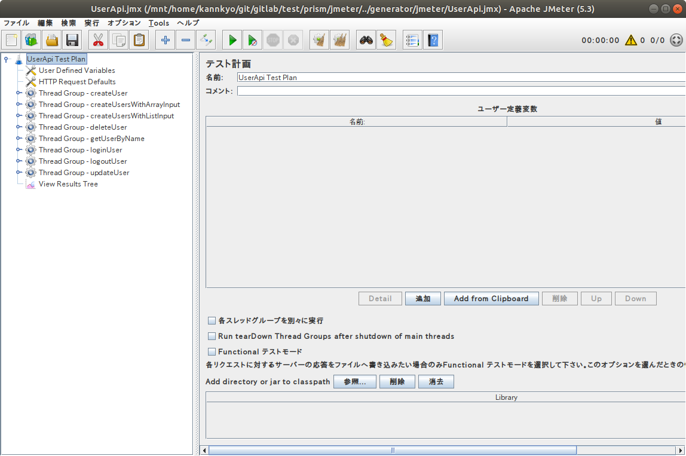

---

テスト実行中は、停止ボタン( :stop_sign: )が有効化される。​

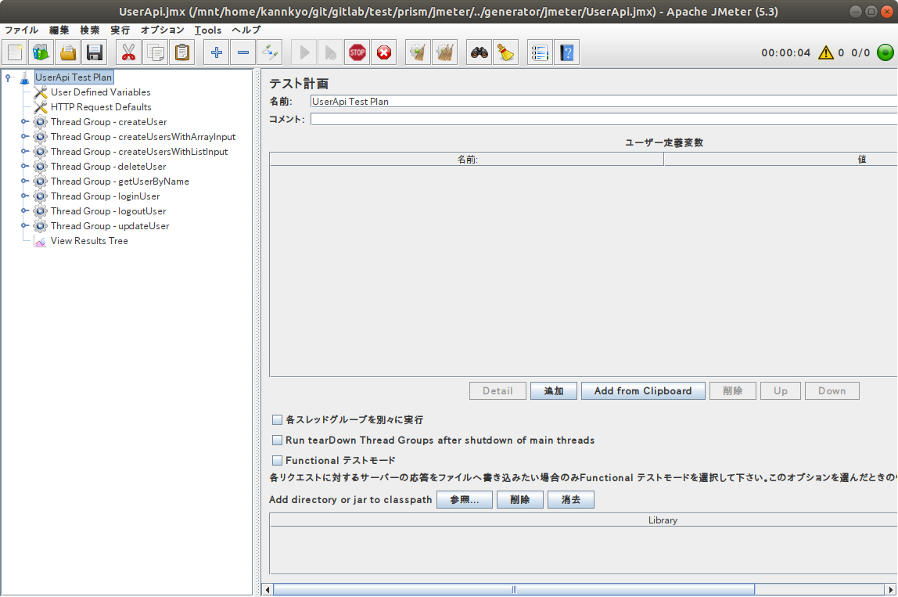

### ユーザ定義変数

ユーザ定義変数は、全てのテストで使用できる変数の一覧表である。

- 名前 : 変数名

- 値 : 変数の値

  - `${__P(commandLineArgName, defaultValue)}`は、テスト実行時に指定できる値。コマンドライン引数またはプロパティファイルで指定できる。

    - コマンドライン引数

        ```bash
      /path/to/jmeter --commandArgName=value
      ```
  
    - プロパティファイル

        ```bash
      /path/to/jmeter -q /path/to/propetries.properties
      ```

      ```properties
        commandLineArgName=value
      ```

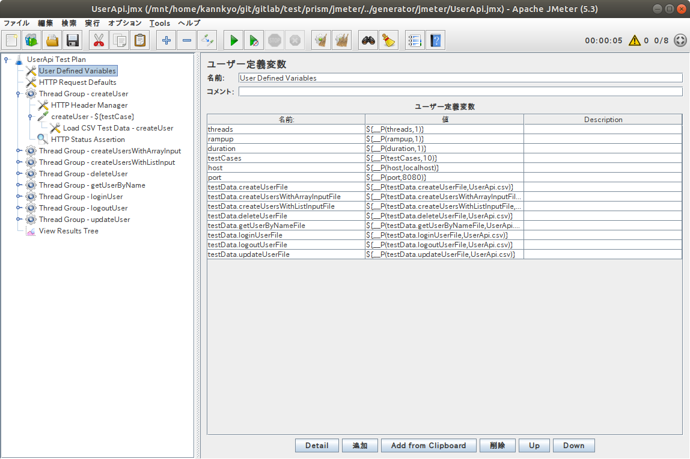

### HTTPリクエスト初期値設定

HTTPリクエスト初期設定は、全てのスレッドグループで共通的に用いられるリクエストのデフォルトパラメータである。

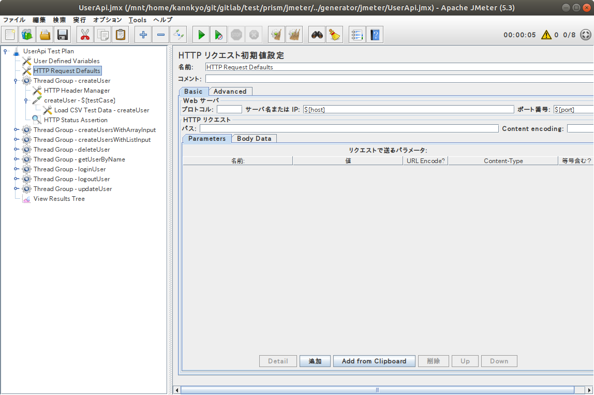

### 結果をツリーで表示

結果をツリーで表示は、テスト実行結果をツリー形式で表示する画面である。

- Text欄

  REST APIの戻り値が正常終了(200)のときは黒字、異常終了(4xx)は赤字。assertに失敗した場合は`HTTP Status Assertion`が表示される。

- Assertion result欄

  規格値は200で実際の値は422であったことが表示されている。

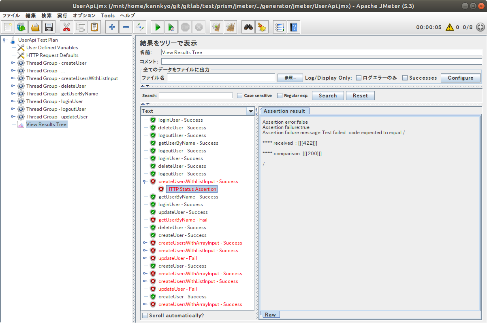

---

REST APIに送信したリクエストのボディ。

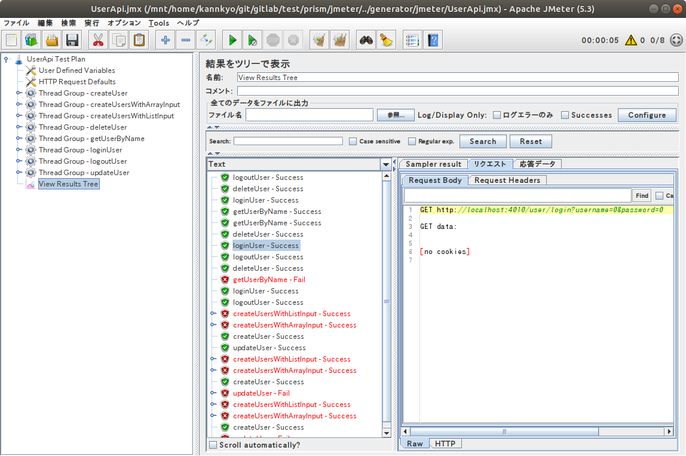

---

REST APIに送信したリクエストのヘッダ。

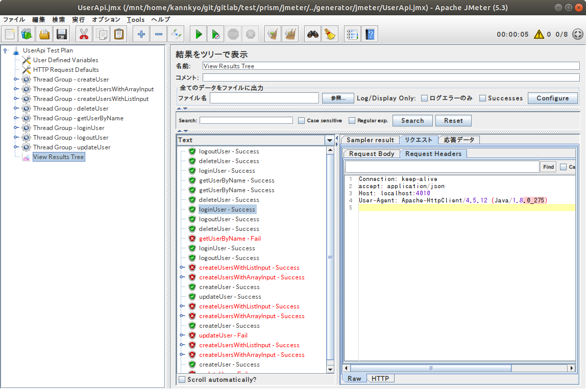

---

REST APIから受信したレスポンスのボディ。

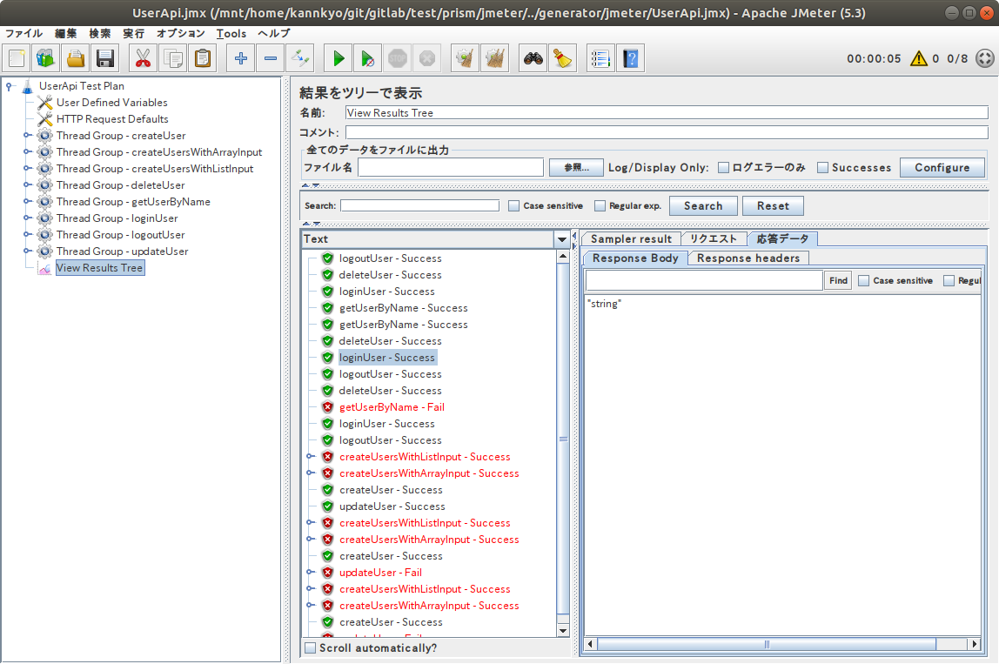

---

REST APIから受信したレスポンスのヘッダ。

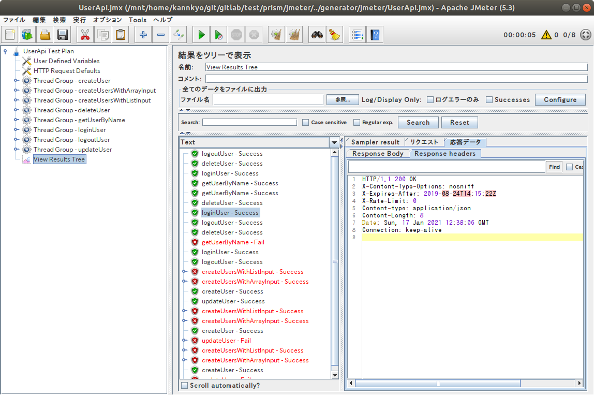

### スレッドグループ

スレッドグループは、テストを実行する最小単位である。

スレッド数とループ回数を指定することで、同じ試験ケースを並行して繰り返し実行できる。

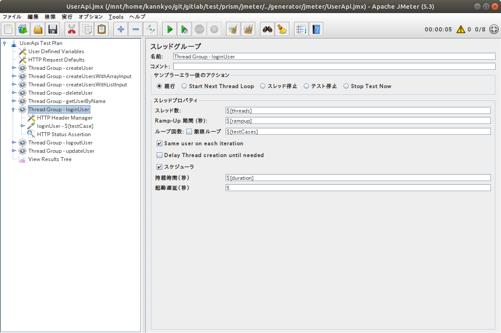

### HTTP ヘッダマネージャ

HTTPヘッダマネージャは、HTTPリクエストの実行時に付与するヘッダである。

この例ではリクエストのフォーマットがjsonであることを示すヘッダを付与している。

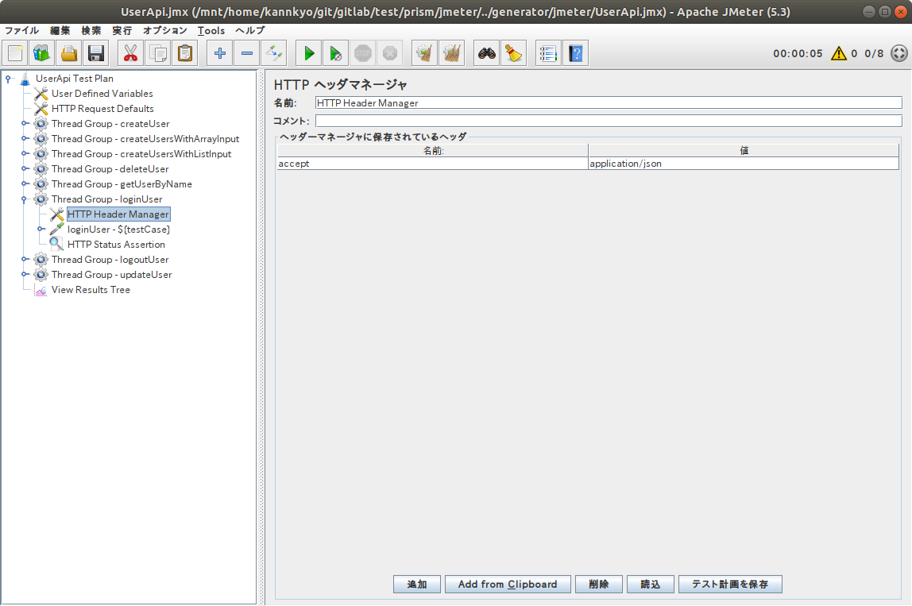

### HTTP リクエスト

HTTPリクエストは、リクエストのパラメータを定義する。

一般に、REST APIのパラメータは以下の3種類に分類される。

1. ボディパラメータ
2. パスパラメータ
3. クエリパラメータ

#### ボディパラメータの場合

ボディパラメータの場合は、Body Data タブに記述する。

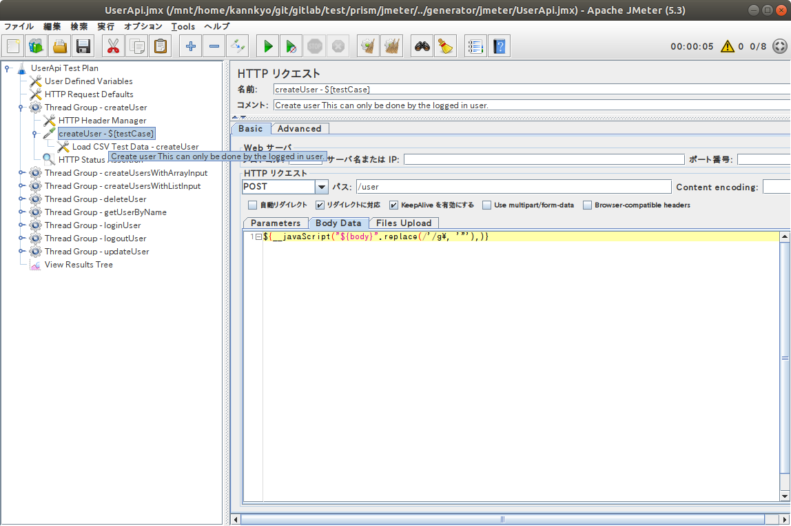

#### クエリパラメータの場合

クエリパラメータは、Parametersタブに記述する。

この例では、以下のURLにリクエストが送信される。

<http://server:port/user/login?username=${username}&paassword=${password}>

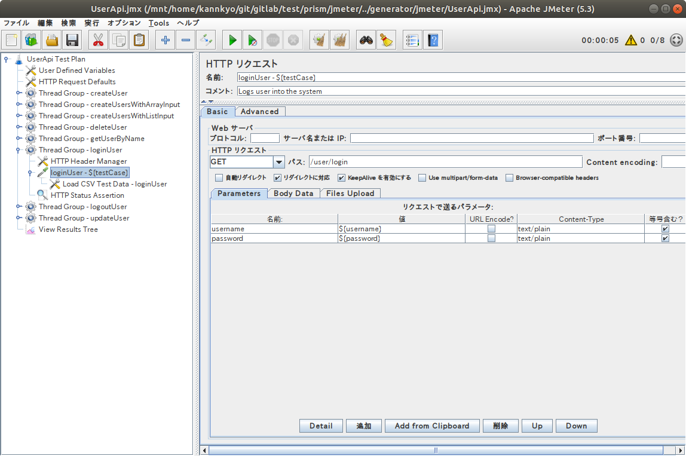

#### パスパラメータの場合

パスパラメータは、パス欄に記述する。

この例では`/user/login`がパスパラメータに相当する。


### CSV Data Set Config

CSV Data Set Configは、csvファイルから試験データを読み込む。

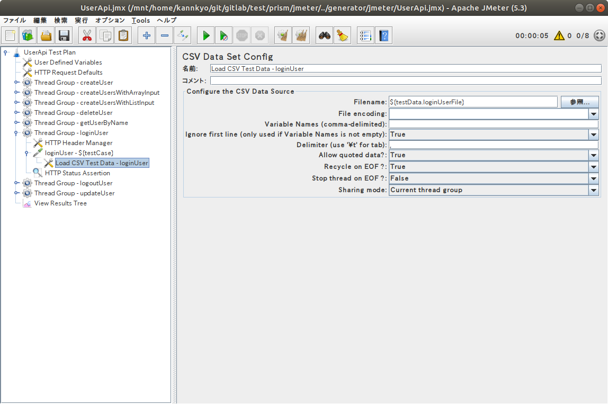

### アサーション

アサーションは、テスト結果を検証する。

この例ではレスポンスコードのみを検証する。

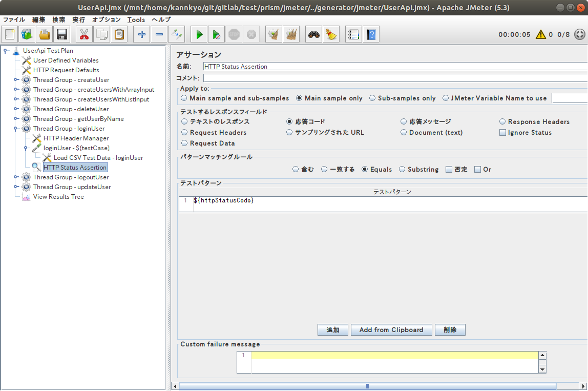

## CUIモード

### 実行

以下のようにコマンドラインからテストを実行する。

```bash
$ ./app/apache-jmeter-5.3/bin/jmeter -n -l ./.tmp/log.jtl -p ./jmeter-cui.properties -q ../jmeter.properties -t ../generator/jmeter/UserApi.jmx
Created the tree successfully using ../generator/jmeter/UserApi.jmx
Starting standalone test @ Sun Jan 17 21:50:41 JST 2021 (1610887841575)
Waiting for possible Shutdown/StopTestNow/HeapDump/ThreadDump message on port 4445
Tidying up ...    @ Sun Jan 17 21:50:47 JST 2021 (1610887847484)
... end of run
```

- `-n`
- `-l ./.tmp/log.jtl` カレントディレクトリからログファイルへの相対パス
- `-p ./jmeter-cui.properties` カレントディレクトリからJMeterのプロパティファイルへの相対パス
- `-q ../jmeter.properties` カレントディレクトリからテストのプロパティファイルへの相対パス
- `-t ../generator/jmeter/UserApi.jmx` カレントディレクトリからテストファイルへの相対パス

### ダッシュボード生成

JMeterは、テスト実行後にログファイルからテスト結果を統計的に解析し、ダッシュボードを生成できる。

```bash
./app/apache-jmeter-5.3/bin/jmeter -g ./.tmp/log.jtl -o ./.tmp/dashboard
```

- `-g ./.tmp/log.jtl` カレントディレクトリからログファイルへの相対パス
- `-o ./.tmp/dashboard` カレントディレクトリからダッシュボードへの相対パス

### ダッシュボード

#### サマリ

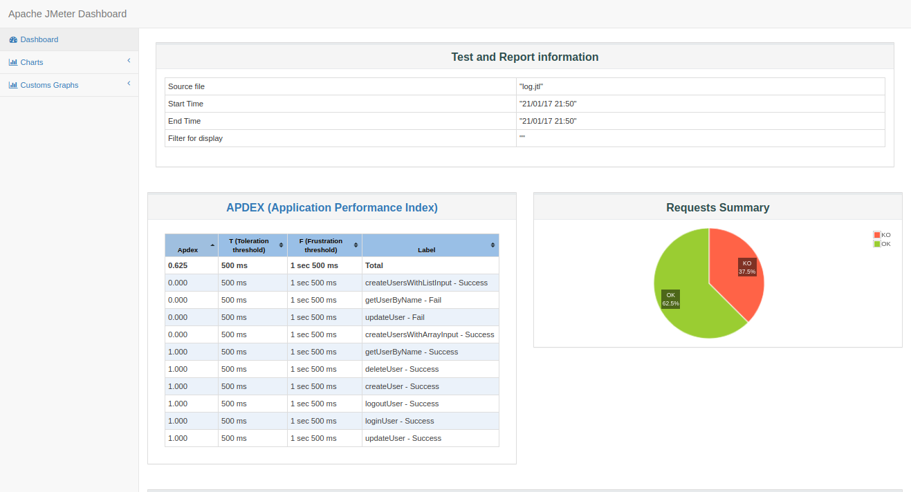

| 表示項目                              | 概要                                                                       |
| ------------------------------------- | -------------------------------------------------------------------------- |
| Test and Report information           | テストとレポートの基本情報                                                 |
| APDEX (Application Performance Index) | APDEXは、APIのレスポンスタイムに対してユーザ満足度を計測するための業界標準 |
| Requests Summary                      | 正常終了(OK)、異常終了(KO)                                                 |
| Statistics                            | リクエスト毎の実行結果、応答時間、スループット、通信速度                   |
| Errors                                | 異常終了の理由とその数の概要                                               |
| Top 5 Errors by sampler               | 異常終了のうち上位5つの詳細                                                |

Table: トップページの表示項目

---

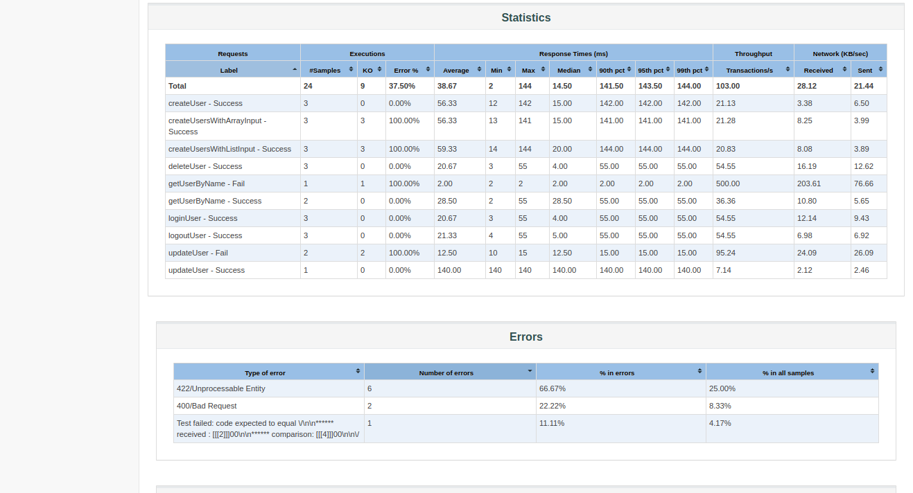

---

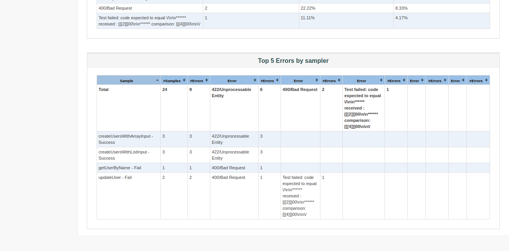

#### Charts / Over Time

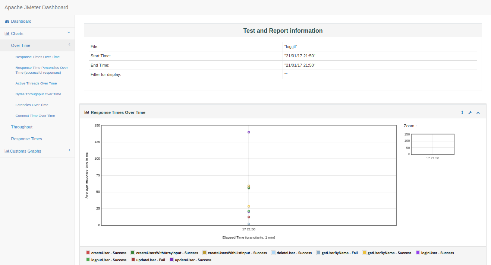

| 表示項目                                                   | 概要                                       |
| ---------------------------------------------------------- | ------------------------------------------ |
| Test and Report information                                | テストとレポートの基本情報                 |
| Response Times Over Time                                   | リクエスト別の平均応答時間の時間変化       |
| Response Time Percentiles Over Time (successful responses) | パーセンタイル別の応答時間の時間変化       |
| Active Threads Over Time                                   | リクエスト別の有効スレッド数の時間変化     |
| Bytes Throughput Over Time                                 | スループットの時間変化                     |
| Latencies Over Time                                        | リクエスト別の平均応答レイテンシの時間変化 |
| Connect Time Over Time                                     | リクエスト別の平均接続時間の時間変化       |

Table: Over Time の表示項目

#### Charts / Throughput

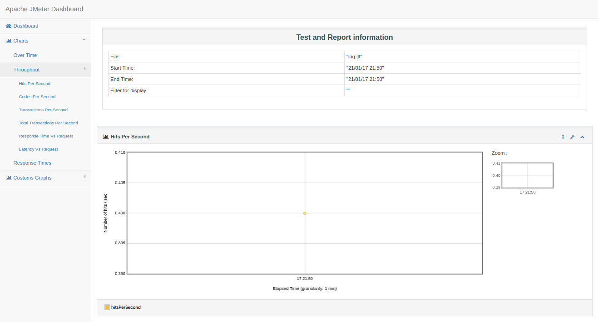

| 表示項目                      | 概要                                                       |
| ----------------------------- | ---------------------------------------------------------- |
| Test and Report information   | テストとレポートの基本情報                                 |
| Hits Per Second               |                                                            |
| Codes Per Second              | レスポンスコード別の単位時間当たりの応答数の時間変化       |
| Transactions Per Second       | リクエスト別のトランザクション数の時間変化                 |
| Total Transactions Per Second | 合計トランザクション数の時間変化                           |
| Response Time Vs Request      | 単位時間当たりのリクエスト数と応答時間の中央値の相関関係   |
| Latency Vs Request            | 単位時間当たりのリクエスト数とレイテンシの中央値の相関関係 |

Table: Throughput の表示項目

#### Charts / Response Time

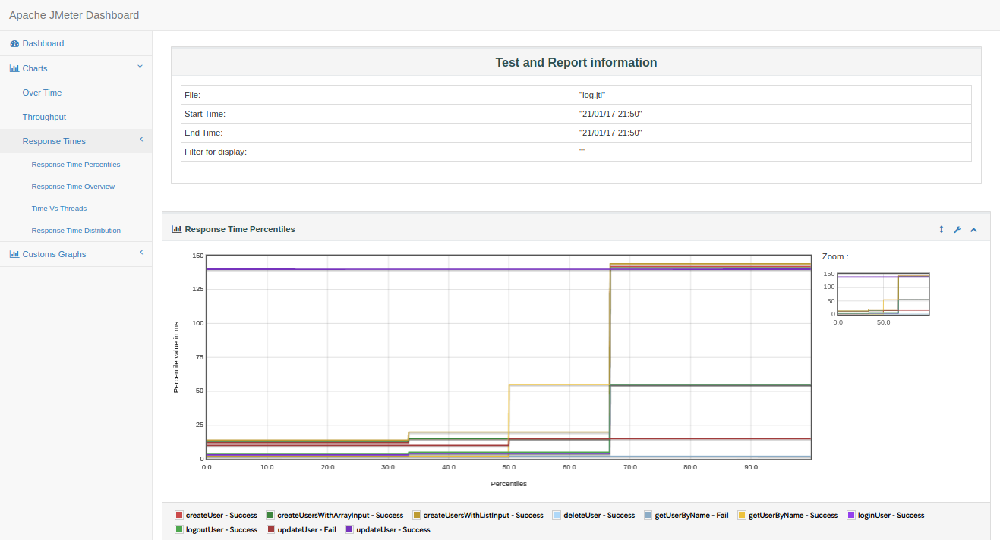

| 表示項目                    | 概要                                                 |
| --------------------------- | ---------------------------------------------------- |
| Test and Report information | テストとレポートの基本情報                           |
| Response Time Percentiles   | リクエスト別の応答時間とパーセンタイルの相関関係     |
| Response Time Overview      | 応答時間別と応答数のヒストグラム                     |
| Time Vs Threads             | リクエスト別の有効スレッド数と平均応答時間の相関関係 |
| Response Time Distribution  | 応答時間と応答数のヒストグラム                       |

Table: Response Time の表示項目
